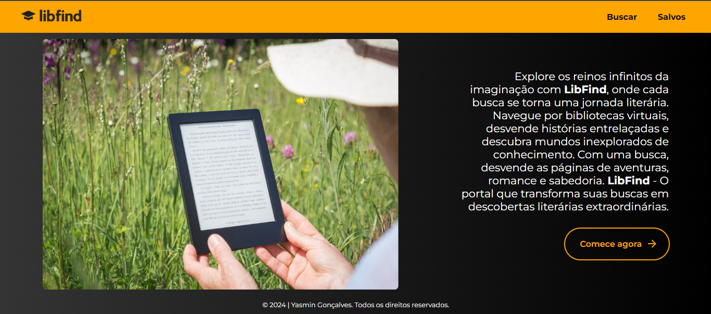

# LibFind

O site Libfind te proporciona buscar diversos livros, consultar detalhes e salvar seus livro favoitos! Com base na [API de livros do Google](https://developers.google.com/books?hl=pt-br). Clique aqui para acessar o [**LibFind**](https://libfind.vercel.app/)

---
### Tecnologias utilizadas:

- React;
- Axios;
- Figma;
- Vercel;
- SweetAlert.

###

[Clique aqui para acessar o ***Figma***](https://www.figma.com/file/1ZmvIGL5HJkGYtkJT9ly1v/libfind?type=design&node-id=0-1&mode=design&t=MyERimk9q1TTerrk-0)

---
### Autora:

- [Yasmin Gonçalves](https://github.com/yasmingcv)